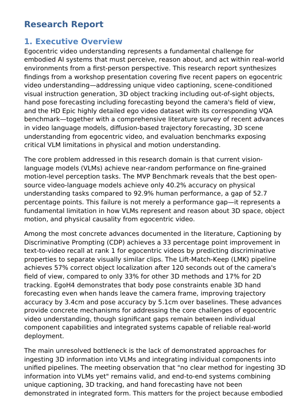
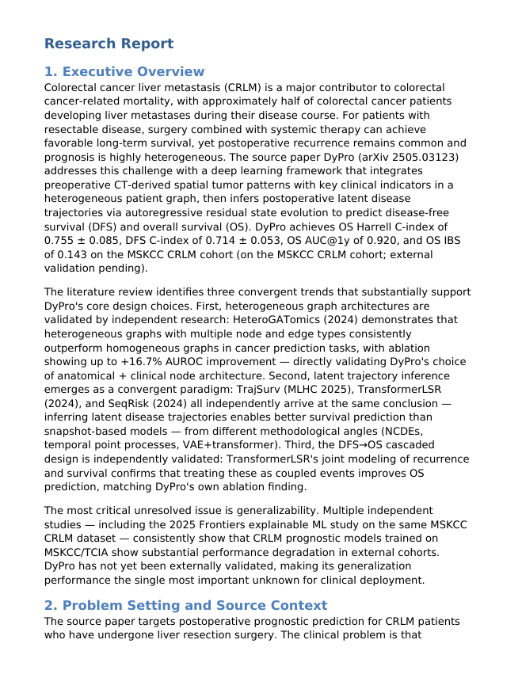
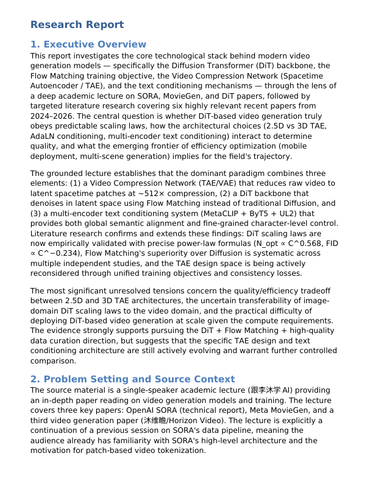
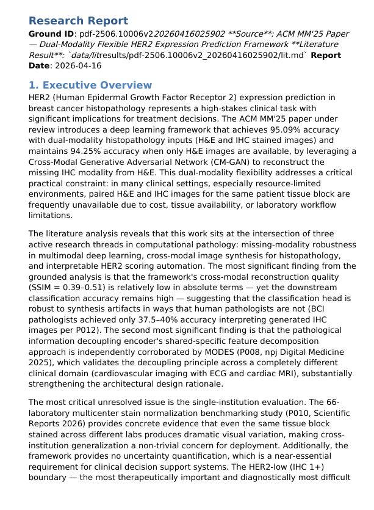
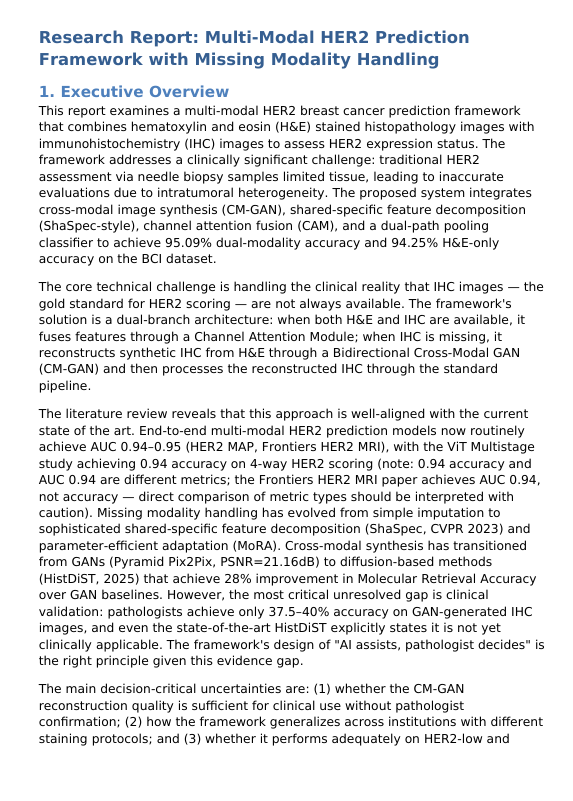

<h1 align="center">🎬 OneResearchClaw Showcase</h1>

  <i>Real-world materials in → structured, deliverable, and traceable research reports out</i>

  &nbsp;
  &nbsp;
  

---

OneResearchClaw is designed for mixed-input workflows in real research and project settings: meetings, documents, tables, slide decks, ZIP material packages, and remote links such as arXiv, YouTube, and Bilibili can all enter the same **grounding → research → review → export** pipeline.

This page presents **5 representative cases**, covering:

- 🧠 **Multi-topic meeting splitting**
- 🔗 **Remote-link grounding**
- 🎚️ **Controllable research depth**
- ♻️ **Review → rewrite loop**
- 📦 **Mixed-material delivery / bilingual export**

---

## Case 1 · Meeting Input → Multi-Topic Reports

  
  
  

> **Target capability:** A single meeting input is not forced into one overall report. Instead, the system identifies multiple topics and splits them into independently deliverable grounded reports.

<!-- <table>
<tr>
<td width="360" style="width:360px; min-width:360px; vertical-align:middle;">

👆 Click to preview Topic 01 English PDF

</td>
<td>

#### 🧾 Input

- A meeting / discussion transcript: [`meeting-case1.txt`](./inputs/case1/meeting-case1.txt)
- The content contains multiple topic segments.

#### 🧠 Topic Splitting Result

OneResearchClaw automatically splits this meeting into two topic-level grounded reports:

| Topic        | Theme                               |
| ------------ | ----------------------------------- |
| **Topic 01** | **Egocentric Video Understanding**  |
| **Topic 02** | **Long-Video Reasoning Evaluation** |

#### ⚙️ Pipeline

|                        |                                                              |
| :--------------------- | :----------------------------------------------------------- |
| 🧠 **Capability focus** | Multi-topic detection + topic-level grounded summary         |
| 🧩 **Grounding**        | Detects topic boundaries and splits the meeting into independent grounded units |
| 🔎 **Research**         | Each topic can receive its own background, related work, and evidence |
| 📄 **Output**           | Each topic generates an independent report, with both English and Chinese versions supported |
| 📦 **Delivery**         | Suitable for long meetings, group meetings, interviews, and discussion records |

#### 🎯 What this case demonstrates

OneResearchClaw can split a long meeting into multiple parallel topic branches, preventing different issues from being mixed into the same report.

  &nbsp;
  

</td>
</tr>
</table> -->

<table width="100%" style="table-layout: fixed;">
<colgroup>
  <col width="38%">
  <col width="62%">
</colgroup>
<tr>
<td align="center" valign="middle">

👆 Click to preview Topic 01 English PDF

</td>
<td valign="top">

#### 🧾 Input

- A meeting / discussion transcript: [`meeting-case1.txt`](./inputs/case1/meeting-case1.txt)
- The content contains multiple topic segments.

#### 🧠 Topic Splitting Result

OneResearchClaw automatically splits this meeting into two topic-level grounded reports:

| Topic | Theme |
|---|---|
| **Topic 01** | **Egocentric Video Understanding** |
| **Topic 02** | **Long-Video Reasoning Evaluation** |

#### ⚙️ Pipeline

| | |
| :--- | :--- |
| 🧠 **Focus** | Multi-topic detection + topic-level grounding |
| 🧩 **Grounding** | Split the meeting into independent grounded units |
| 🔎 **Research** | Add topic-specific background and evidence |
| 📄 **Output** | Generate one report per topic, with EN / ZH versions |
| 📦 **Delivery** | Suitable for meetings, interviews, and discussions |

#### 🎯 What this case demonstrates

OneResearchClaw can split a long meeting into multiple topic branches,  
preventing different issues from being mixed into the same report.

  &nbsp;
  

</td>
</tr>
</table>

### More Outputs

- [Topic 01 · English Report](./reports/case1/meeting_meeting-case1_20260416004530_topic01/en/report.pdf)
- [Topic 01 · 中文报告](./reports/case1/meeting_meeting-case1_20260416004530_topic01/zh/report.pdf)
- [Topic 02 · English Report](./reports/case1/meeting_meeting-case1_20260416004530_topic02/en/report.pdf)
- [Topic 02 · 中文报告](./reports/case1/meeting_meeting-case1_20260416004530_topic02/zh/report.pdf)

---

## Case 2 · arXiv Link → Grounded Report

  
  
  

> **Target capability:** Start directly from a remote paper link, without asking the user to manually download and organize a local PDF.

<table>
<tr>
<td width="360" style="width:360px; min-width:360px; vertical-align:middle;">

👆 Click to view the arXiv-link English PDF

</td>
<td>

#### 🧾 Input

- One arXiv paper link: [`arxiv-case2.txt`](./inputs/case2/arxiv-case2.txt)

#### ⚙️ Pipeline

| Stage | What happens |
| :--- | :--- |
| 🔗 **Input** | Use an arXiv link directly |
| 🧩 **Grounding** | Fetch and structure the paper content |
| 🔎 **Research** | Add background and related work |
| 📄 **Report** | Generate a readable grounded report |
| 🌐 **Value** | Remote input enters the same pipeline |

#### 🎯 What this case demonstrates

OneResearchClaw supports “link as input”, showing that the pipeline is not limited to manually prepared local files.

  &nbsp;
  

</td>
</tr>
</table>

---

## Case 3 · Same Input, Different Research Depths

  
  
  

> **Target capability:** Show how the same input behaves under `simple / medium / complex` research modes, demonstrating controllable coverage, cost, and analytical depth.

<table>
<tr>
<td width="360" align="center" style="width:360px; min-width:360px; vertical-align:middle;">

👆 Click to preview the medium-mode English PDF

</td>
<td>

#### 🧾 Input

- The same remote video material: [`youtube.txt`](./inputs/case3/youtube.txt)
- The same task objective: generate a grounded research report based on the video content
- The only variable: use `simple / medium / complex` `research_mode` respectively

#### 🎚️ Research Depth Comparison

| Mode | What it shows |
| :--- | :--- |
| `simple` | Fast background supplementation; small set of core related works |
| `medium` | Balanced coverage, analysis depth, and execution cost |
| `complex` | More opened sources; deeper related work and evidence organization |

#### 🎯 What this case demonstrates

This case demonstrates OneResearchClaw's research depth control:  
with the same input material and the same report-generation task, the user can adjust research intensity through `research_mode`.

`simple` is better for quickly understanding the content and generating a lightweight report; `medium` is suitable for normal default usage; `complex` is better for research scenarios that need stronger literature support and deeper analysis.  
This allows users to make an explicit trade-off between speed and depth based on time budget, token cost, and delivery requirements.

  &nbsp;
  &nbsp;
  

  &nbsp;
  &nbsp;
  

</td>
</tr>
</table>

---

## Case 4 · Review → Rewrite for Better Deliverables

  
  
  

> **Target capability:** Show that OneResearchClaw can keep diagnosing and rewriting a report through reviewer feedback, instead of stopping at a first-pass result.

<table>
<tr>
<td width="360" align="center" style="width:360px; min-width:360px; vertical-align:middle;">

👆 Click to preview the after-rewrite English PDF

</td>
<td>

#### 🧾 Input

- Initial material: [`2506.10006v2.pdf`](./inputs/case4/2506.10006v2.pdf)
- Initial report: the first generated report before review
- Review setting: an external reviewer scores and diagnoses the report, while a writer applies repair actions

#### ♻️ Review → Rewrite Process

This case shows a complete review → rewrite loop:  
the initial report is first scored by the reviewer and diagnosed for issues; the writer then revises the report based on feedback, and the revised report enters the next review round. The final report passes the quality gate after a bounded number of iterations.

| Round   |   Score    | Verdict |
| :------ | :--------: | :-----: |
| Round 0 | `60 / 100` | repair  |
| Round 1 | `78 / 100` | repair  |
| Round 2 | `83 / 100` | repair  |
| Round 3 | `91 / 100` |  pass   |

#### 📈 Iteration Effect

- Went through `4` review checks;
- Completed `3` repair / rewrite rounds;
- Score improved from `60 / 100` to `91 / 100`;
- Total improvement: `+31` points;
- Final status: `pass`, and the report entered the final delivery stage.

#### 🔧 Main Revision Directions

- Added missing literature background and key related work;
- Strengthened evidence support for core conclusions and reduced generic statements;
- Improved the report structure so that problem background, method analysis, and application value are more coherent;
- Improved deliverability so the report is more suitable for direct PDF / DOCX / PPTX export.

#### 🎯 What this case demonstrates

This case demonstrates OneResearchClaw's review → rewrite quality loop:  
the report is not exported immediately after generation. Instead, it is structurally diagnosed by a reviewer and revised round by round by a writer following explicit repair actions.

In this example, the first report scored `60 / 100`; after 3 rewrite rounds, it improved to `91 / 100` and passed the quality check.  
This shows that the review loop can materially improve report structure, evidence specificity, analytical depth, and final deliverability.

  &nbsp;
  

  &nbsp;
  

</td>
</tr>
</table>

---

## Case 5 · Mixed Materials → Bilingual Final Delivery

  
  
  

> **Target capability:** Demonstrate final-delivery capabilities, including mixed-material integration, structured reporting, and bilingual outputs.

<table>
<tr>
<td width="360" style="width:360px; min-width:360px; vertical-align:middle;">

👆 Click to view the final English PDF

</td>
<td>

#### 🧾 Input

- Mixed materials / combined sources: [`HER2-case5.zip`](./inputs/case5/HER2-case5.zip)
- Multiple already-grounded materials can be integrated into one final report

#### ⚙️ Pipeline

|                       |                                                              |
| :-------------------- | :----------------------------------------------------------- |
| 🧩 **Integration**     | Combines materials from different sources into a unified report structure |
| 🔎 **Research**        | Supplements necessary external evidence based on grounded content |
| ♻️ **Review**          | Can enter a reviewer-driven bounded revision loop            |
| 🌍 **Language output** | Supports English and Chinese delivery                        |
| 📦 **Final goal**      | Produces a deliverable report for real-world use cases       |

#### 🎯 What this case demonstrates

This case shows the full pipeline from multiple inputs to bilingual outputs, rather than a single isolated capability.

  &nbsp;
  

</td>
</tr>
</table>