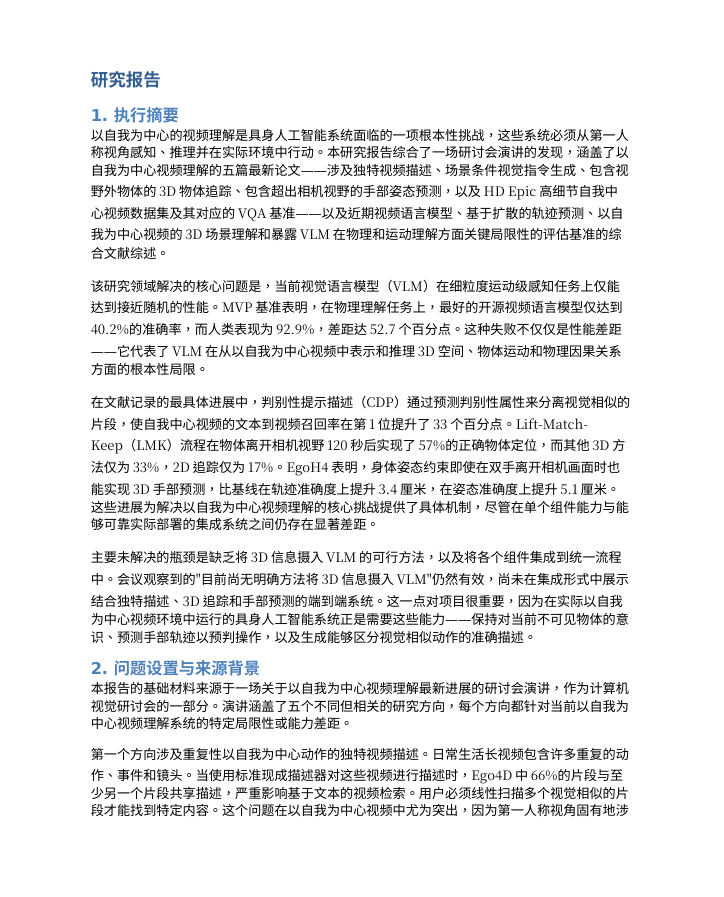
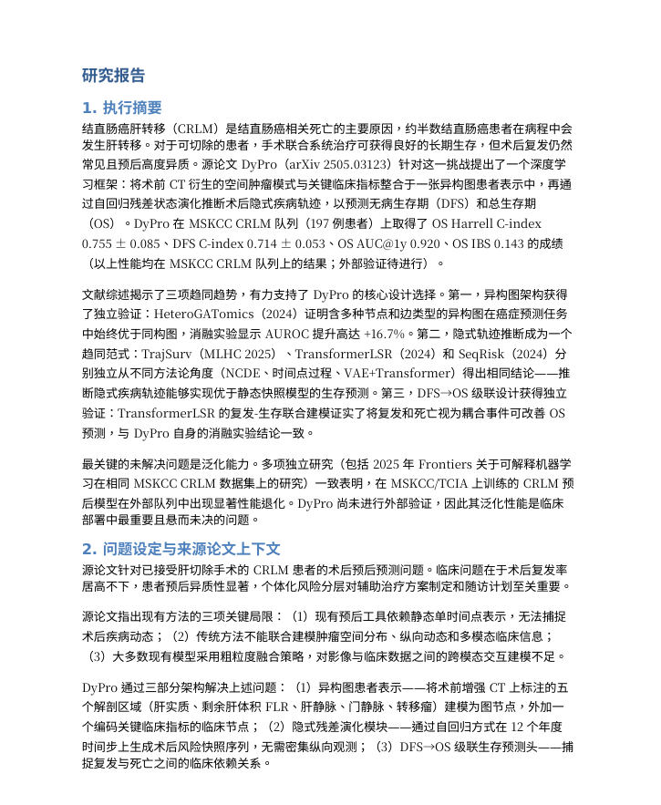
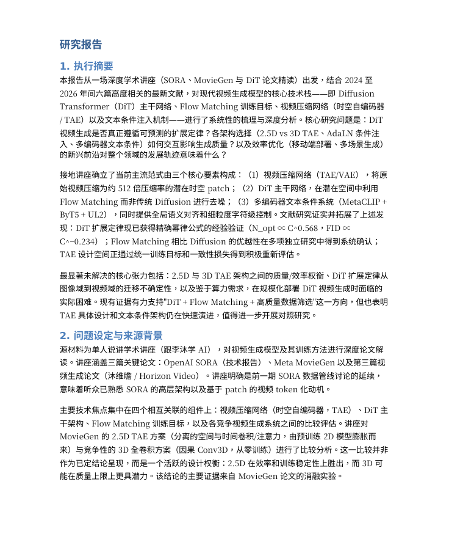
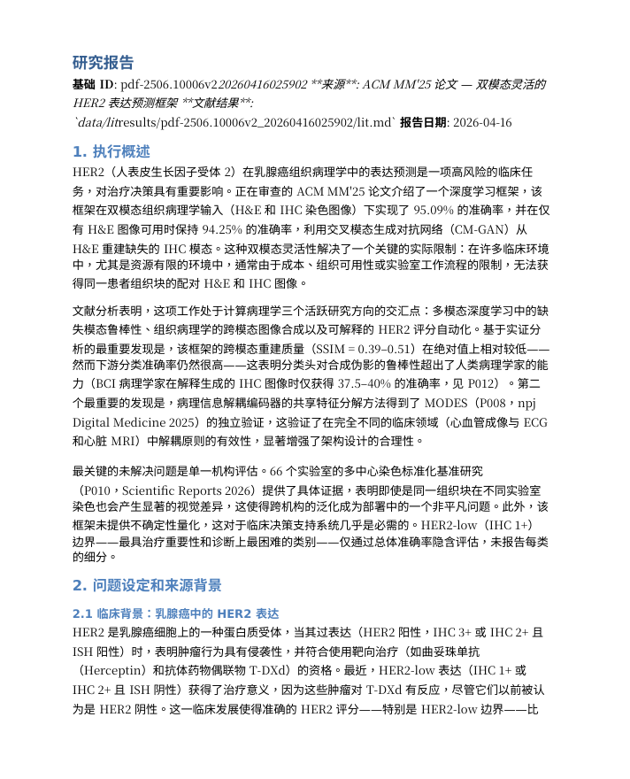
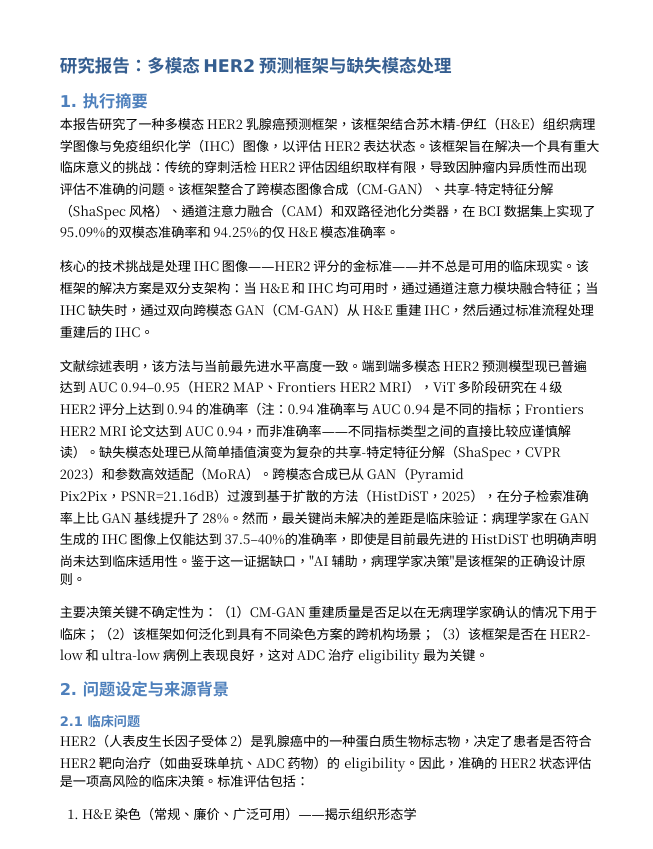

<h1 align="center">🎬 OneResearchClaw Showcase </h1>

  <i>真实材料输入 → 结构化、可交付、可追溯的研究报告输出</i>

  &nbsp;
  &nbsp;
  

---

OneResearchClaw 面向真实工作流中的混合输入场景：会议、文档、表格、PPT、ZIP 材料包，以及 arXiv / YouTube / Bilibili 等远程链接，统一进入同一条 **grounding → research → review → export** 流水线。  

本页展示 **5 个代表性案例**，分别对应：

- 🧠 **多 topic 会议拆分**
- 🔗 **远程链接 grounding**
- 🎚️ **可控 research 深度**
- ♻️ **review → rewrite 闭环**
- 📦 **综合材料交付 / 双语导出**

---

## Case 1 · 会议输入 → 多 Topic 拆分报告

  
  
  

> **目标能力：** 一场会议输入，不是只生成一份总报告，而是自动识别多个 topic，并拆分成多个可独立交付的 grounded report。

<table>
<tr>
<td width="340">

👆 点击预览 Topic 01 中文 PDF

</td>
<td>

#### 🧾 输入

- 一场会议 / 讨论材料的转录文本：[`meeting-case1.txt`](./inputs/case1/meeting-case1.txt)
- 内容内部包含多个主题段落

#### 🧠 Topic 拆分结果

OneResearchClaw 将这场会议自动拆分为两个 topic-level grounded report：

| Topic | 主题 |
|---|---|
| **Topic 01** | **Egocentric Video Understanding** |
| **Topic 02** | **Long-Video Reasoning Evaluation** |

#### ⚙️ 流水线过程

|                 |                                                   |
| :-------------- | :------------------------------------------------ |
| 🧠 **能力焦点**  | 多 topic detection + topic-level grounded summary |
| 🧩 **Grounding** | 自动识别会议中的主题边界并拆成独立 grounded unit  |
| 🔎 **Research**  | 可对每个 topic 分别补充背景、相关工作与证据       |
| 📄 **输出**      | 每个 topic 独立生成报告，支持中英文版本           |
| 📦 **交付**      | 适合长会议、组会、访谈、讨论记录等材料            |

#### 🎯 这个案例证明了什么

OneResearchClaw 不只是“总结一段会议内容”，而是能够把长会议拆成多个并行主题分支，避免不同议题混在同一份报告里。

  &nbsp;
  

</td>
</tr>
</table>

### 更多输出

- [Topic 01 · 中文报告](./reports/case1/meeting_meeting-case1_20260416004530_topic01/zh/report.pdf)
- [Topic 01 · English Report](./reports/case1/meeting_meeting-case1_20260416004530_topic01/en/report.pdf)
- [Topic 02 · 中文报告](./reports/case1/meeting_meeting-case1_20260416004530_topic02/zh/report.pdf)
- [Topic 02 · English Report](./reports/case1/meeting_meeting-case1_20260416004530_topic02/en/report.pdf)

---

## Case 2 · arXiv 链接 → Grounded Report

  
  
  

> **目标能力：** 从远程论文链接直接启动，不要求用户先准备本地 PDF，也不要求手工整理材料。

<table>
<tr>
<td width="340">

👆 点击查看 arXiv 链接案例中文 PDF

</td>
<td>

#### 🧾 输入

- 一条 arXiv 论文链接：[`arxiv-case2.txt`](./inputs/case2/arxiv-case2.txt)

#### ⚙️ 流水线过程

|                 |                                              |
| :-------------- | :------------------------------------------- |
| 🔗 **输入形式**  | remote paper link                            |
| 🧩 **Grounding** | 获取论文内容并转为结构化 note                |
| 🔎 **Research**  | 可在论文已有内容基础上继续补充背景与相关工作 |
| 📄 **输出**      | 形成可读性更强的研究报告，而不仅是原文摘录   |
| 🌐 **价值点**    | 远程输入直接接入统一流水线，适合快速调研     |

#### 🎯 这个案例证明了什么

OneResearchClaw 支持“链接即输入”，说明 pipeline 并不依赖单一的本地文件上传路径。

  &nbsp;
  

</td>
</tr>
</table>

---

## Case 3 · 同一输入，不同 Research 深度

  
  
  

> **目标能力：** 展示同一输入在 `simple / medium / complex` 三种 research 深度下的差异，体现覆盖范围、成本和分析细度的可控性。

<table>
<tr>
<td width="340" align="center">

👆 点击预览 medium 中文 PDF

</td>
<td>

#### 🧾 输入

- 同一份远程视频材料：[`youtube.txt`](./inputs/case3/youtube.txt)
- 同一任务目标：基于视频内容生成 grounded research report
- 唯一变化：分别使用 `simple / medium / complex` 三档 `research_mode`

#### 🎚️ Research 深度对比

| Research Mode | 展示重点 |
| :--- | :--- |
| `simple` | 快速补充背景与少量核心相关工作，适合低成本 briefing |
| `medium` | 在文献覆盖、分析深度和执行成本之间取得平衡，适合作为默认模式 |
| `complex` | 打开更多来源，补充更系统的相关工作、研究脉络和证据整理 |

#### 🎯 这个案例证明了什么

这个 case 展示了 OneResearchClaw 的 research depth control：  
同一份输入材料、同一个报告任务，可以通过 `research_mode` 调整调研强度。

`simple` 更适合快速了解内容和生成轻量报告；`medium` 更适合日常默认使用；`complex` 更适合需要更充分文献支撑和更深入分析的研究场景。  
这使得用户可以根据时间预算、token 成本和交付要求，在速度与深度之间做明确取舍。

  &nbsp;
  &nbsp;
  

  &nbsp;
  &nbsp;
  

</td>
</tr>
</table>

---

## Case 4 · Review → Rewrite 提升交付质量

  
  
  

> **目标能力：** 展示 OneResearchClaw 不是一次性吐出结果，而是可以在 reviewer feedback 驱动下继续诊断与重写。

<table>
<tr>
<td width="340" align="center">

👆 点击预览 After Rewrite 中文 PDF

</td>
<td>

#### 🧾 输入

- 初始材料：[`2506.10006v2.pdf`](./inputs/case4/2506.10006v2.pdf)
- 初版报告：进入 review 前的初始生成结果
- Review 配置：外部 reviewer 负责评分与诊断，writer 根据 repair actions 执行重写

#### ♻️ Review → Rewrite 过程

这个 case 展示了一次完整的 review → rewrite 闭环：  
初版报告先由 reviewer 评分并指出问题，随后 writer 根据反馈进行修订，再进入下一轮 review。最终报告在有限轮迭代后通过质量门控。

| Round | Score | Verdict |
| :--- | :---: | :---: |
| Round 0 | `60 / 100` | repair |
| Round 1 | `78 / 100` | repair |
| Round 2 | `83 / 100` | repair |
| Round 3 | `91 / 100` | pass |

#### 📈 迭代效果

- 总共经历 `4` 次 review 检查；
- 完成 `3` 轮 repair / rewrite；
- 分数从 `60 / 100` 提升到 `91 / 100`；
- 提升幅度为 `+31` 分；
- 最终状态为 `pass`，报告进入最终交付阶段。

#### 🔧 主要修订方向

- 补充缺失的文献背景与关键相关工作；
- 强化核心结论的证据支撑，减少泛泛表述；
- 改进报告结构，使问题背景、方法分析和应用价值更连贯；
- 增强 deliverability，让报告更适合直接进入 PDF / DOCX / PPTX 导出。

#### 🎯 这个案例证明了什么

这个 case 展示了 OneResearchClaw 的 review → rewrite 质量闭环：  
报告不是生成后直接导出，而是会经过 reviewer 的结构化诊断，并由 writer 按照明确的 repair actions 逐轮修订。

在这个例子中，初版报告得分为 `60 / 100`，经过 3 轮重写后提升到 `91 / 100` 并通过质量检查。  
这说明 review loop 能够实际提升报告的结构完整性、证据具体性、分析深度和最终交付质量。

  &nbsp;
  

  &nbsp;
  

</td>
</tr>
</table>

---

## Case 5 · 综合材料 → 双语最终交付

  
  
  

> **目标能力：** 展示最终交付层面的综合能力，包括混合材料整合、结构化输出，以及中英文双版本结果。

<table>
<tr>
<td width="340">

👆 点击查看最终交付中文 PDF

</td>
<td>

#### 🧾 输入

- mixed materials / combined sources：[`HER2-case5.zip`](./inputs/case5/HER2-case5.zip)
- 可包含多种已 grounded 的材料组合

#### ⚙️ 流水线过程

|                |                                          |
| :------------- | :--------------------------------------- |
| 🧩 **整合**     | 将不同来源材料汇总到统一报告结构中       |
| 🔎 **Research** | 在 grounded 内容基础上补充必要的外部证据 |
| ♻️ **Review**   | 可进入 reviewer 驱动的有限轮修订         |
| 🌍 **语言输出** | 支持中英文版本交付                       |
| 📦 **最终目标** | 面向真实使用场景的最终可交付报告         |

#### 🎯 这个案例证明了什么

这个 case 展示了 pipeline 从多种输入到双语结果的整体闭环，而不是单点能力。

  &nbsp;
  

</td>
</tr>
</table>